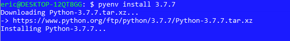

# DesafioCredereCoordenadas


[](https://codecov.io/gh/EricGPTI/DesafioCredereCoordenadas)


Desafio Backend Credere.

# Rodando o Projeto Localhost
### Linux
Assegure-se de que todas as dependências estão instaladas e o sistema operacional
atualizado.

### Ubuntu 18.04 ou Superior
Instale os pacotes necessários para rodar o python
```
sudo apt-get install -y build-essential libssl-dev zlib1g-dev 
libbz2-dev libreadline-dev libsqlite3-dev wget curl llvm gettext 
libncurses5-dev tk-dev tcl-dev blt-dev libgdbm-dev git python-dev 
python3-dev aria2 vim libnss3-tools python3-venv liblzma-dev
```
Após conclusão atualize o sistema.

```
sudo apt install update
```
Com o sistema atualizado, recomendo instalar o pyenv para não 
usarmos o python do sistema operacional, evitando problemas futuros.

```
curl -L https://github.com/pyenv/pyenv-installer/raw/master/bin/pyenv-installer | bash
```
Agora que o pyenv está instalado edite o arquivo .bashrc e passe as 
seguintes configurações no final do arquivo:

```
export PATH="~/.pyenv/bin:$PATH"
eval "$(pyenv init -)"
```
Se tudo ocorreu bem, vamos agora selecionar a versão do python que irá 
rodar o projeto.

```
pyenv install 3.7.7
```
O Ubuntu irá iniciar a instalação do nosso pacote python.



As vezes o sistema demora um pouco, se isso acontecer, tecle **enter**, se
a versão foi instalada uma mensagem será mostrada.


Após a instalação, vamos verificar a versão global do python no sistema:

```
pyenv global
```
Será mostrado a versão global, possivelmente a versão do SO.

Vamos setar nossa versão como global

```
pyenv global 3.7.7
```
Agora que a nossa versão do python foi definida, vamos instalar o pipenv
para nos ajudar a gerenciar os pacotes.

Você pode conferir digitando ```pyenv global```

```
pip install pipenv
```
**Pode acontecer de uma mensagem como esta seja gerada: ```WARNING: You are using pip version 20.2.3; however, 
version 20.3.3 is available. You should consider upgrading via 
the '/home/eric/.pyenv/versions/3.8.5/bin/python -m pip install 
--upgrade pip' command.```. Não se preocupe, é apenas o pip informando que 
ele tem uma atualização. Ele já te dá o comando para resolver o problema.

Uma vez com o pipenv instalado, vamos configurar o pipenv para criar o 
diretório virtual dentro do nosso diretório do projeto. Para isso, vamos
fazer uma pequena alteração no arquivo .bash_profile

```
vim ~/.bash_profile
```
Se não conseguir editar, use o sudo para receber privilégios.
Se o arquivo estiver vazio, feche-o e edite o arquivo .bashrc

```
vim ~/.bashrc
```
Na parte inferior do arquivo, logo acima do local onde configuramos a 
variável de ambiente para o pyenv coloque a seguinte instrução:

```
export PIPENV_VENV_IN_PROJECT=1
```


Salve e feche o arquivo.

Se quiser validar a variável criada use:

```
echo $PIPENV_VENV_IN_PROJECT
```
o retorno deve ser **1**.

### Instalando os pacotes do sistema
Agora que tudo está configurado, faça o download do projeto do github
```
git clone https://github.com/EricGPTI/DesafioCredereCoordenadas.git
```
Uma vez de posse do seu arquivo, acesse o diretório do projeto.

```
cd DesafioCredereCoordenadas/
```


Agora estando dentro do projeto, vamos instalar toda as dependências do 
projeto.

### Instalando Dependência
O projeto possui dois tipos de dependência, sendo uma de produção e outra
de desenvolvimento. Esta última contém os pacotes para testarmos a aplicação.

**Instalação de Desenvolvimento**

```pipenv sync ```

**Instalação completa com pacotes de Testes**

```pipenv sync -d```

Este comando irá baixar todas as dependências de produção e criar nosso
ambiente virtual.

É possível que o pacote psycopg2 dê erro, não se preocupe, essa lib é 
utilizada apenas para ambiente de produção para conexão com postgresql.

Se mesmo assim desejar instalar, faça o seguinte:
```sudo apt-get install libpq-dev```
Depois rode novamente ```pipenv sync```

Agora que todas as dependências foram instaladas, vamos rodar nosso projeto.

Primeiro ative o ambiente virtual.
```
pipenv shell
```


Veja que agora existe uma diferença na forma como vemos o nosso shell.

O nome do nosso ambiente virtual é colocado logo no início, isso significa
que nosso ambiente está ativo e tudo quanto instalarmos agora será instalado
neste ambiente, apartado do SO.

Precisamos criar um arquivo chamado .env, onde colocaremos nossas variáveis de 
ambiente.

```
vim .env
```
Neste arquivos vamos colocar algumas variáveis.

```
DEBUG=True
ALLOWED_HOSTS=localhost, 127.0.0.1
SECRET_KEY = ^6+%t#h)albl@%f(fh=oax*k78m$-_r^n)ll
```
A variável SECRET_KEY é apenas uma sugestão, fique a vontade para gerar
sua própria string.

Agora que temos nossas variáveis criadas e salvas em nosso arquivo, feche 
e salve.

Rode o servidor local:

```
python manage.py runserver
```
Logo de cara nosso servidor nos avisa que temos migrações que ainda não 
foram feitas. No entanto, nosso servidor já está no ar e você pode acessar
o endereço local.

Acesse:

**localhost:8000/admin**


Jé é possível acessar o servidor, no entanto, ainda não conseguimos logar, 
por não termos usuário criado. Também não podemos acessar as rotas pois não
temos o token, que só é gerado com a criação do usuário.

Vamos então rodar nossas migrações.

Pare o servidor: **CTRL+c**

Execute o seguinte comando:

```
python manage.py migrate
```


Com as migrações rodadas, vamos criar um superusuário que dará acesso 
ao admin da aplicação para criamos usuários e tokens.

```
python manage.py createsuperuser
```
Após rodar o comando irá solicitar criar um email para o usuário.
Posteriormente um password.

O password é requisitado ter no mínimo 8 caracteres, caso você insira um
password fraco ele irá pedir para confirmar que quer criar mesmo assim.
Digite **y** e prossiga.


Pronto, agora já somos capazes de acessar o painel admin e criar usuários 
e tokens.
Agora rode o servidor novamente e faça login na aplicação.

```
python manage.py runserver
```


Como o nosso usuário admin já está criado, vamos criar um token pra ele.


De posse do token, já podemos fazer nossas requisições aos endpoints da API.

### Endpoints
Método: GET
Endpoint: http://127.0.0.1:8000/api/v1/coordenadas/atual/
Ação: Retorna a posição atual da sonda.

Método: POST
Endpoint: http://127.0.0.1:8000/api/v1/coordenadas/start/
Ação: Envia a sonda para a posição inicial (0,0,90) - Este método
deve ser executado primeiro para que a posição inicial seja criada no 
banco de dados, do contrário um erro 500 será retornado.

Método: POST
Endpoint: http://127.0.0.1:8000/api/v1/coordenadas/movement/
Ação: Envia os comandos de ação no seguinte formato 

```
{
"movimentos" : ["GE", "GE", "M"]
}
```

Json contendo as coordenadas. Não é case sensitive, então aceita maiúsculas, 
minúsculas ou ambas na mesma requisição.

Para fazer chamada aos endpoint, use uma ferramenta como **insomnia ou postman**.
Ou ainda via linha de comando com o curl.

Exemplo de requisição Curl:

```
curl -i -H "Authorization: Token 5fg4s6df4sd135vsdfn" -H "Accept: "Application/json" -H "Content-Type: application/json" -X GET http://127.0.0.1:8000/api/v1/coordenadas/atual/
```
